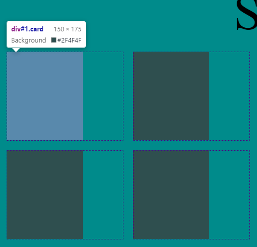

# Vanilla JS Memory Match game

## Front-end

HTML card classes are given ID's to represent unique cards.

A class of 'clicked' is given to any card selected by the player.

Once a card has been 'clicked' is color changes and content becomes its ID.

## Backend

An array is used as a stack to push or pop cards that are selected.

DOM is used to select elements on the page and to modify different values.

